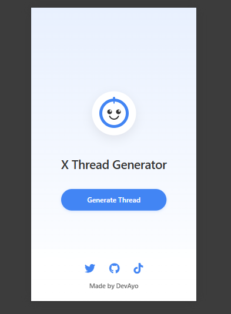

# X Thread Generator

A sleek, production-ready Flask application that helps creators, developers, and founders turn their raw thoughts into polished Twitter/X threads using AI.

## Features

- Modern, gradient UI with a clean and professional design
- Start button that opens a modal for inputting content
- Processing screen with loading animation during thread generation
- AI-powered generation of Twitter/X threads
- Copy individual tweets or the entire thread
- "Made by DevAyo" footer with social links

## Screenshots



## Setup Instructions

### Prerequisites

- Python 3.7+
- pip (Python package manager)

### Installation

1. Clone this repository:
   ```
   git clone <repository-url>
   cd ThreadGen
   ```

2. Create a virtual environment:
   ```
   python -m venv venv
   ```

3. Activate the virtual environment:
   - On Windows:
     ```
     venv\Scripts\activate
     ```
   - On macOS/Linux:
     ```
     source venv/bin/activate
     ```

4. Install dependencies:
   ```
   pip install -r requirements.txt
   ```
   
   If you encounter any issues with dependencies, run:
   ```
   fix_dependencies.bat
   ```

5. Create a `.env` file in the root directory with the following variables:
   ```
   OPENAI_API_KEY=your_openai_api_key_here
   SECRET_KEY=your_secret_key_here
   
   # DevAyo Social Links
   TWITTER_URL=https://twitter.com/ctouvise
   TIKTOK_URL=https://tiktok.com/@devayo_py
   GITHUB_URL=https://github.com/DevAyo
   ```

### Running the Application

1. Start the Flask development server:
   ```
   python run.py
   ```
   
   Or simply double-click on `run.bat`.

2. Open your browser and navigate to:
   ```
   http://127.0.0.1:5000/
   ```

## Usage

1. Click the "Start Making Threads" button on the home page
2. In the modal, enter your raw thoughts, bullet points, or notes
3. Click "Generate Thread" and wait for the processing to complete
4. View your polished X thread
5. Copy individual tweets or the entire thread using the provided buttons

## Deployment

For production deployment, consider using Gunicorn as a WSGI server:
```
gunicorn run:app
```

## License

This project is licensed under the MIT License.

## Acknowledgements

- Built by DevAyo
- Powered by Flask and OpenAI 